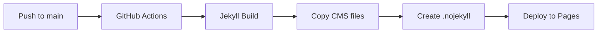

# MaRCH Lab Website

Microwave and RF Circuit ResearcH Lab 공식 웹사이트

Jekyll + GitHub Pages + Decap CMS로 구축된 정적 사이트입니다.

## 🚀 빠른 시작

### 필수 요구사항

* Ruby 3.2+
* Bundler (`gem install bundler`)
* Node.js 20+ (선택사항, CSS/JS 빌드용)
* Git

### 로컬 개발 환경 설정

```bash
# 저장소 클론
git clone https://github.com/MaRCH-JJH/MaRCH-Homepage.git
cd MaRCH-Homepage

# Ruby 의존성 설치
bundle install

# Jekyll 개발 서버 실행
bundle exec jekyll serve --livereload

```

브라우저에서 `http://localhost:4000/MaRCH-Homepage/` 접속

### Decap CMS 로컬 테스트

```bash
# Netlify CLI 설치 (한 번만)
npm install -g netlify-cli

# Netlify 로그인
netlify login

# 로컬에서 CMS 프록시 실행
netlify dev

```

`http://localhost:8888/admin/`에서 CMS 접속 가능

## 📁 프로젝트 구조

```text
├── _config.yml              # Jekyll 설정
├── Gemfile                  # Ruby 의존성
├── _data/                   # 사이트 데이터 (CMS로 관리)
│   ├── site.yml             # 사이트 전체 설정
│   ├── members.yml          # 멤버 정보
│   ├── research.yml         # 연구 분야
│   ├── awards.yml           # 수상 경력
│   └── publications.yml     # 논문/성과
├── _layouts/                # 레이아웃 템플릿
│   ├── default.html         # 기본 레이아웃
│   ├── home.html            # 홈 페이지
│   ├── page.html            # 일반 페이지
│   └── collection.html      # 컬렉션 리스트 페이지
├── _includes/               # 재사용 컴포넌트
├── assets/
│   ├── css/main.css         # 메인 스타일시트
│   └── js/main.js           # 메인 자바스크립트
├── admin/                   # Decap CMS 설정
│   ├── config.yml           # CMS 컬렉션 정의
│   └── index.html           # CMS 엔트리 포인트
├── .github/workflows/       # GitHub Actions
└── docs/                    # 인수인계 문서

```

## ✏️ 콘텐츠 관리 (Decap CMS)

### 관리자 페이지 접속

1. 배포된 사이트에서 `/admin/` 경로 접속
2. GitHub 계정으로 로그인
3. 콘텐츠 수정 후 **Publish** 클릭

### 주요 컬렉션

| 컬렉션 | 설명 | 필드 |
| --- | --- | --- |
| **사이트 설정** | 네비게이션, 푸터, 히어로 등 | 단일 파일 |
| **멤버** | 교수, 연구원, 학생, 졸업생 | 이름, 직책, 학위, 연구분야, 링크 등 |
| **연구 분야** | 4대 연구 분야 | 제목, 설명, 키워드, 프로젝트, 대표논문 |
| **수상 경력** | 연도별 수상 내역 | 수상명, 기관, 날짜, 수상자, 이미지 |
| **논문/성과** | 연도별 논문 목록 | 제목, 저자, 저널, DOI, 타입, 분야 |

### 이미지 업로드 가이드

* **파일명**: 영문 소문자, 숫자, 하이픈만 사용 (예: `prof-kim.jpg`)
* **용량**: 1MB 이하 권장
* **크기**:
* 프로필: 300x300px (정방형)
* 연구분야: 800x500px (16:10)
* 수상: 400x300px (4:3)


* **형식**: JPG, PNG, WebP

## 🌐 배포 파이프라인

### GitHub Pages 설정

1. 저장소 Settings > Pages
2. Source: **GitHub Actions** 선택
3. 워크플로우 자동 실행 확인

### 배포 프로세스



### 워크플로우 파일: `.github/workflows/pages.yml`

* Ruby 3.2 + Bundler 캐시
* Jekyll 프로덕션 빌드
* Decap CMS 정적 파일 복사
* `.nojekyll` 자동 생성 (언더바 파일 보호)

## 🔧 커스터마이징

### 색상 테마 변경

`_data/site.yml`의 `theme` 섹션 수정:

```yaml
theme:
  primary_color: "#0071e3"    # 메인 액션 색상
  accent_color: "#0066cc"     # 링크/아웃라인 색상
```

CSS 변수는 `assets/css/main.css`의 `:root`에서 정의됩니다.

### 네비게이션 메뉴 변경

`_data/site.yml`의 `navigation` 배열 수정:

```yaml
navigation:
  - title: "홈"
    url: "/"
    en: "Home"
  - title: "새 메뉴"
    url: "/new-page/"
    en: "New Page"

```

### 폰트 변경

`assets/css/main.css`의 `--font-display`, `--font-text` 변수 수정

기본값: Apple SF Pro 시스템 폰트 스택

## 🔐 Decap CMS 인증 설정

### Netlify Identity 연동 (권장)

1. Netlify 대시보드 > Site settings > Identity
2. **Enable Identity** 클릭
3. **Registration preferences** > **Invite only** 선택 (중요!)
4. **Git Gateway** > **Enable Git Gateway** 클릭
5. **Services** > **Git Gateway** > **Auth providers** > **GitHub** 활성화

### 보안 주의사항

> ⚠️ **반드시 'Invite only' (신규 가입 차단) 설정하세요!**
> * `Disable Signup` = `Invite only` 동일
> * 관리자만 사용자 초대 가능
> * 무단 계정 생성 방지
> 
> 

### 사용자 초대 방법

1. Netlify Identity 탭 > **Invite users**
2. 이메일 입력 > **Send**
3. 수신자가 링크 클릭 후 비밀번호 설정
4. 역할: `Admin` 또는 `Editor` 선택

## 📝 인수인계 체크리스트 (`docs/HANDOVER.md` 참조)

### 저장소 권한 추가

1. GitHub 저장소 > Settings > Collaborators
2. **Add people** > 권한: `Write` 또는 `Admin`

### 자주 하는 실수

| 실수 | 원인 | 해결 |
| --- | --- | --- |
| 이미지 안 보임 | 파일명 한글/공백 | 영문 소문자+하이픈 사용 |
| 빌드 실패 | YAML 문법 오류 | CMS에서 수정 권장 |
| 메뉴 안 바뀜 | 캐시 | 브라우저 강제 새로고침 |
| 다크모드 안됨 | localStorage | 개발자도구 > Application > Clear |

### 도메인 연결 시

1. Settings > Pages > Custom domain 입력
2. DNS 레코드 추가:
* `A` 레코드: `185.199.108.153`, `185.199.109.153`, `185.199.110.153`, `185.199.111.153`
* `CNAME` 레코드: `www` → `your-username.github.io`


3. Enforce HTTPS 체크

## 🛠 트러블슈팅

### Jekyll 빌드 에러

```bash
# 캐시 삭제 후 재빌드
bundle exec jekyll clean
bundle exec jekyll build

```

### Ruby 버전 문제

```bash
# rbenv 사용 시
rbenv install 3.2.0
rbenv local 3.2.0
bundle install

```

### GitHub Actions 실패

* Actions 탭에서 로그 확인
* `bundle install` 실패 시: `Gemfile.lock` 삭제 후 재실행
* 권한 에러: Settings > Actions > General > Workflow permissions > **Read and write permissions**

## 📄 라이선스

MIT License - 자유롭게 사용, 수정, 배포 가능

## 🤝 기여하기

1. Fork the repository
2. Create feature branch (`git checkout -b feature/amazing-feature`)
3. Commit changes (`git commit -m 'Add amazing feature'`)
4. Push to branch (`git push origin feature/amazing-feature`)
5. Open Pull Request

---

**문의**: wlsgh8403@kangwon.ac.kr
